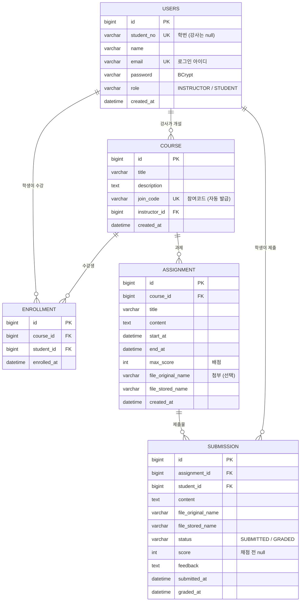

# ERD 설계

## 1. 다이어그램

## 2. 유니크 제약

| 테이블 | 제약 | 이유 |
|---|---|---|
| USERS | `email` UNIQUE | 로그인 아이디 중복 방지 |
| USERS | `student_no` UNIQUE | 학번 중복 가입 방지 (null은 여러 개 허용) |
| COURSE | `join_code` UNIQUE | 코드로 강좌를 하나만 찾아야 함 |
| ENROLLMENT | (`course_id`, `student_id`) UNIQUE | 같은 강좌 중복 수강 방지 |
| SUBMISSION | (`assignment_id`, `student_id`) UNIQUE | **B3** 과제당 학생 1건 |

## 3. 저장하지 않고 계산하는 값

| 값 | 계산 방법 |
|---|---|
| 과제 배지 (예정/진행중/마감) | `now < start_at` → 예정, `start_at ≤ now ≤ end_at` → 진행중, `now > end_at` → 마감 |
| 미제출자 | 강좌 수강생(ENROLLMENT) 중 SUBMISSION이 없는 학생 |
| 제출률 | 제출 수 ÷ 수강생 수 |
| 평균 점수 | GRADED 제출물의 score 평균 |

## 4. 비즈니스 규칙 ↔ 필드

| 규칙 | 검사에 쓰는 필드 |
|---|---|
| B1 기간 내 제출 | `ASSIGNMENT.start_at ≤ 현재 ≤ end_at` |
| B2 수강생만 열람·제출 | `ENROLLMENT`에 (course, student) 존재 |
| B3 과제당 1건, 재제출은 덮어쓰기 | `SUBMISSION` (assignment, student) UNIQUE → 있으면 update |
| B4 채점 완료는 재제출 불가 | `SUBMISSION.status == GRADED` |
| B5 본인 강좌만 수정·삭제·채점 | `COURSE.instructor_id == 로그인 사용자 id` |
| B6 0 ≤ 점수 ≤ 배점 | `SUBMISSION.score`, `ASSIGNMENT.max_score` |
| B7 종료 > 시작 | `ASSIGNMENT.end_at > start_at` |
| B8 제출물 있으면 과제 삭제 불가 | `SUBMISSION` 에 해당 assignment 존재 여부 |
